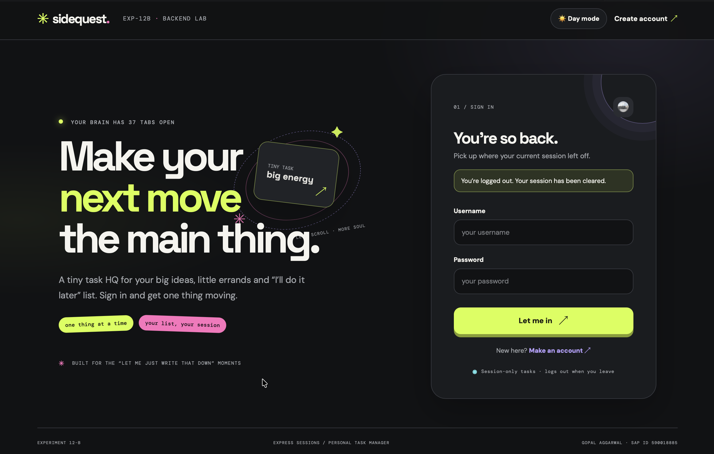
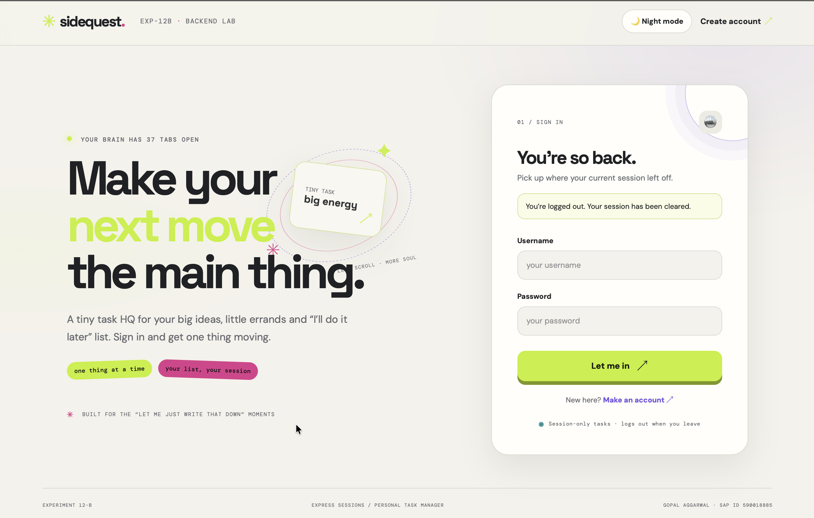
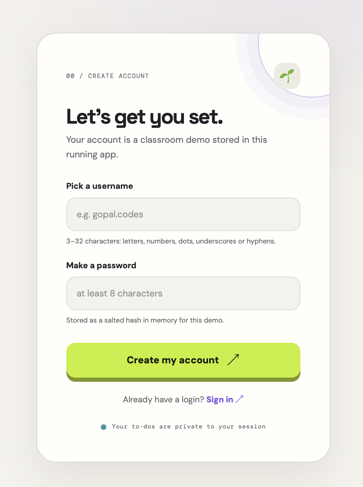
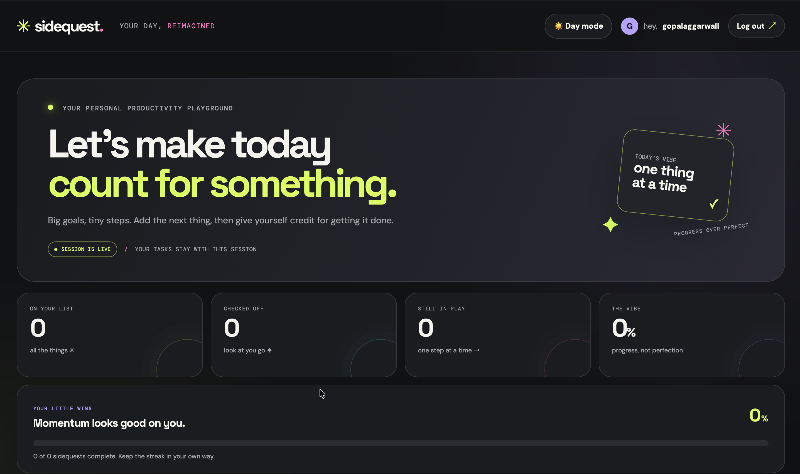
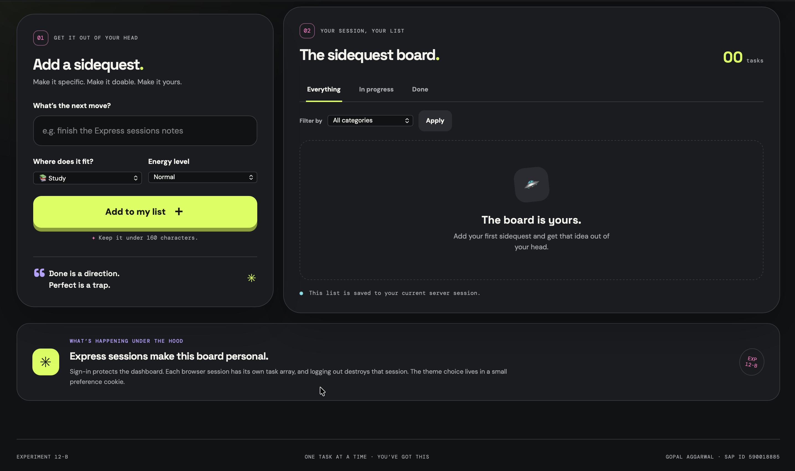

# Experiment 12-B — Session Login and Sidequest To-Do List

**Course:** Backend Development Lab  
**Course Outcome:** CO2 — Build web applications  
**Student:** Gopal Aggarwal · B.Tech CSE · SAP ID 590018885 · UPES Dehradun  
**Date:** 3 October 2026

**Server:** [`app.js`](./app.js) · **Views:** [`views/`](./views/) · **Styles and theme control:** [`public/`](./public/)

---

## Screenshots

Click a screenshot link to open the full image.

| Page or feature | Screenshot |
|---|---|
| Sign-in page — night theme | [Open screenshot](./screenshots/1.png) |
| Sign-in page — day theme | [Open screenshot](./screenshots/2.png) |
| Create-account page | [Open screenshot](./screenshots/3.png) |
| Dashboard — overview and progress | [Open screenshot](./screenshots/4.png) |
| Dashboard — task board and session details | [Open screenshot](./screenshots/5.png) |









---

## 1. Aim

To build a small Express and EJS application where users register and sign in, access a protected dashboard, and manage a to-do list stored in their current server session.

## 2. Objectives

After completing this experiment, I am able to:

1. Create Express routes for registration, login, a protected dashboard, task actions and logout.
2. Validate data submitted through HTML forms.
3. Use session middleware and authentication middleware to protect private pages.
4. Keep each signed-in session's task list separate from other sessions.
5. Render dynamic pages with EJS templates.
6. Hash passwords with a unique salt using Node.js `scrypt`.
7. Add task completion, category, priority and filter controls.
8. Build a responsive interface with a saved day/night theme preference.

## 3. Requirements and features

### Required session features

- Register with a username and password.
- Sign in and keep the user authenticated with a server-side session.
- Restrict the dashboard and task actions to authenticated users.
- Add, view and delete to-do items stored in the current session.
- Keep each browser session's task list separate.
- End the session on logout. The session cookie expires when the browser session ends, and the app also expires inactive sessions after 30 minutes.

### Additional task-board features

- Mark a task complete or active again.
- Categorize a task as Study, Life admin, Work or Wellness.
- Choose a Low-key, Normal or Big focus priority.
- Filter tasks by completion state and category.
- View task counts and a completion progress bar.
- Switch between night and day appearance; the preference is stored in a separate browser cookie.

## 4. Tools and setup

| Item | Detail |
|---|---|
| Runtime | Node.js |
| Package manager | npm |
| Web framework | Express.js |
| Template engine | EJS |
| Session middleware | `express-session` |
| Password hashing | Node.js `crypto.scrypt` |
| Main server | `app.js` |
| Views | `views/login.ejs`, `views/register.ejs`, `views/dashboard.ejs` |
| Frontend assets | `public/style.css`, `public/app.js` |

From this `EXP-12-B` directory, install the dependencies and start the server:

```bash
npm install
npm start
```

Open `http://localhost:3000`, create an account, sign in and try the task board. For local coursework use, the app creates a temporary session secret if `SESSION_SECRET` is not set. To keep the secret stable between local server restarts, set one before starting the app:

```bash
export SESSION_SECRET="replace-with-a-long-random-value"
npm start
```

Production mode requires `SESSION_SECRET` and marks the session cookie `Secure`, so serve the app over HTTPS. Accounts and sessions use in-memory storage for this lab exercise; they reset when the server restarts. The default in-memory session store is not intended for production deployment.

## 5. Theory

### 5.1 Routes and middleware

An Express route handles a request method and path. `GET` routes render pages or filters, while `POST` routes process forms. Middleware runs as a request passes through the app. The `requireLogin` middleware checks for a user in the session, rejects expired sessions and protects the dashboard and task actions.

### 5.2 Sessions and cookies

The browser receives a session identifier cookie; the related session data is kept on the server. After a successful login, the app regenerates the session ID and saves the username, task array and inactivity deadline in the new session. The cookie is `HttpOnly`, uses `SameSite=Lax` and has no persistent expiry, so it is a browser-session cookie. Protected requests refresh the 30-minute inactivity deadline. Expired sessions are denied and removed from the in-memory store by the cleanup sweep. Logging out destroys the session and clears its cookie.

The theme preference uses a separate `todo-theme` cookie because it is a non-sensitive display setting. It is not used for authentication or task storage.

### 5.3 Password handling

Registration creates a random salt and derives a password hash with Node.js `scrypt`. The account record keeps the salt and hash instead of the original password. During login, the app derives a hash from the submitted password and compares the values with `timingSafeEqual()`.

### 5.4 EJS and task state

Express renders pages with EJS. `<% ... %>` contains template logic, and `<%= ... %>` renders escaped values such as task text, usernames and messages. A task is stored as an object containing an ID, text, category, priority and completion state. The array belongs to `req.session`, so each active session receives a separate board.

## 6. Implementation

### 6.1 Account and session flow

The registration route trims and validates usernames, checks duplicates without regard to letter case, and accepts passwords from 8 to 128 characters. It hashes the password before adding the account to the in-memory account map. The login route verifies the credentials, regenerates the session ID and creates an empty task list for that session. Invalid sign-in attempts show a generic message.

The dashboard and task routes use `requireLogin`. The logout form sends a `POST` request; its route destroys the current session and clears the session cookie.

### 6.2 Task operations

| Method | Route | Purpose |
|---|---|---|
| GET | `/` | Redirect to the dashboard or login page |
| GET | `/register` | Show the registration form |
| POST | `/register` | Validate a new account and hash its password |
| GET | `/login` | Show the sign-in form |
| POST | `/login` | Verify credentials and create a session |
| GET | `/dashboard` | Show the signed-in user's tasks and filters |
| POST | `/todos` | Add a task to the current session |
| POST | `/todos/complete/:id` | Toggle a task's completion state |
| POST | `/todos/delete/:id` | Delete a task from the current session |
| POST | `/logout` | Destroy the current session |

Task text is trimmed and limited to 160 characters. The server validates category and priority against fixed choices. Dashboard query parameters filter the current session's list without changing its stored tasks.

### 6.3 Interface and accessibility

The app uses a playful “sidequest” theme with neon accents, task stats, category and priority chips, completion controls, filters and a progress bar. The layout adapts to mobile screens. Forms have visible labels, status messages use accessible roles, action buttons have descriptive names, and keyboard focus is visible. The theme toggle stores only the day/night preference in a one-year cookie.

## 7. Procedure

1. Create an Express project and install `express`, `ejs` and `express-session`.
2. Configure EJS rendering, URL-encoded form parsing, static files and session middleware.
3. Create registration and login forms and validate their submitted values on the server.
4. Hash each account password with a unique random salt.
5. Regenerate the session ID after a successful login.
6. Protect the dashboard and task routes with authentication middleware.
7. Store task objects in the current session and implement add, complete and delete actions.
8. Add completion and category filters, task summaries and the theme preference control.
9. Destroy the session when the user logs out.
10. Start the server, register, sign in, manage tasks and log out.

## 8. Output and observations

The finished application includes account registration and login, a protected dashboard, session-specific task lists, logout, task categories, priorities, completion controls, filters and a saved day/night preference.

### Observations

1. Authentication middleware can check a session before rendering a private route.
2. The browser stores the session ID while the session's username and task list stay on the server.
3. Regenerating the session ID on login gives the authenticated user a fresh session.
4. Salted password hashes avoid keeping account passwords as readable text.
5. Session storage keeps task lists separate, while the in-memory account and session stores are temporary.

## 9. Viva questions and answers

**Q1. What is a session?**  
A server-side record associated with a browser, usually identified by a cookie.

**Q2. How does the app protect the dashboard?**  
The `requireLogin` middleware checks that the request has a valid signed-in session before continuing.

**Q3. What does `express.urlencoded()` do?**  
It parses URL-encoded form data and makes the submitted fields available through `req.body`.

**Q4. Why regenerate the session after login?**  
It assigns a fresh session ID when the user becomes authenticated.

**Q5. Why store a salt and password hash?**  
The app can verify a submitted password without storing the original password in readable form.

**Q6. Where are to-do items stored?**  
In the signed-in browser's server-side session, so each session has its own task array.

**Q7. What is the purpose of the theme cookie?**  
It remembers the user's day or night display preference; it does not contain authentication data.

## 10. Result and conclusion

The session-based login and to-do application was created with protected routes, session-specific task operations and logout. The additional task-board controls demonstrate how a server-rendered app can add useful interactions while keeping the experiment's session requirements at its center.

## 11. References

1. [Express — Session middleware](https://expressjs.com/en/resources/middleware/session/)
2. [Express — Routing](https://expressjs.com/en/guide/routing/)
3. [Node.js — Crypto: `scrypt`, `randomBytes` and `timingSafeEqual`](https://nodejs.org/api/crypto.html)
4. [EJS — Embedded JavaScript templates](https://github.com/mde/ejs)
